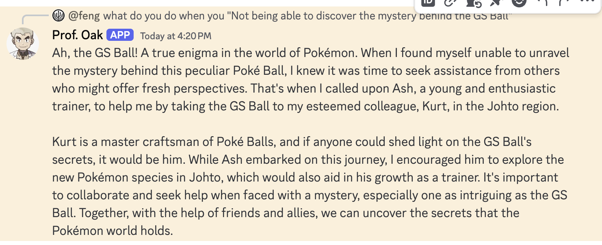
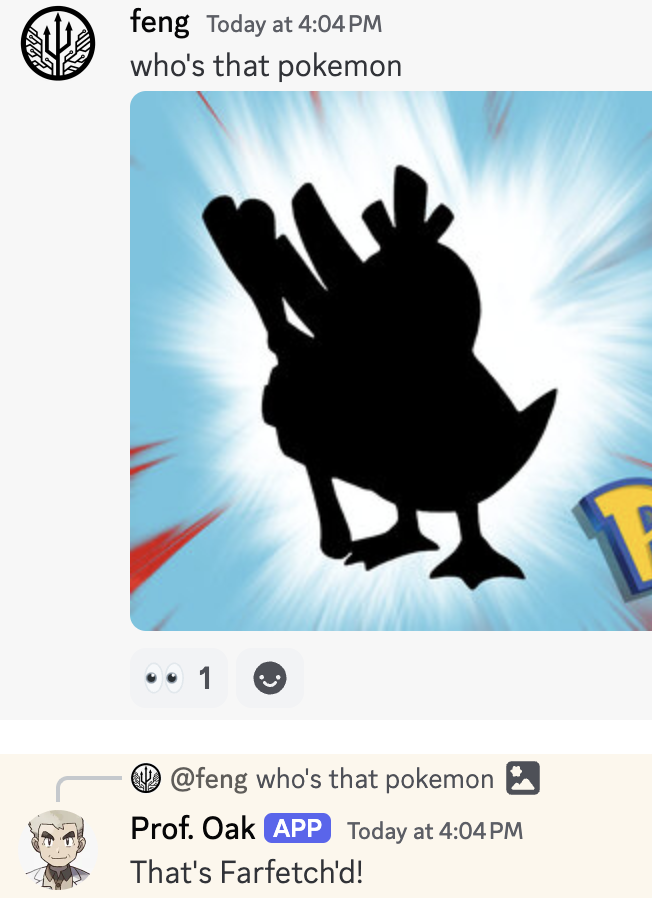

# Introduction
🎉 **Welcome to Fluctlight! Your Gateway to Intelligent Chat Agents** 🎉

Unleash the power of dynamic communication with Fluctlight, the ultimate framework designed for crafting task-based chat agents. Seamlessly configure and deploy your agents across leading platforms like Discord, Slack, and the web with ease.

🚀 **Why Choose Fluctlight?** 🚀

- 🌐 **Cross-Platform Deployment**: Effortlessly reach users on Discord, Slack, or any web interface.
- 🧠 **Advanced Capabilities**:
  - **RAG Retrieval**: Harness the potential of cutting-edge retrieval-augmented generation.
  - **Intent Detection**: Ensure every interaction is contextually relevant.
  - **Speech & Image Understanding**: Elevate your agent's capabilities by integrating speech recognition and image comprehension.

Transform your interaction experiences with Fluctlight, where innovation meets simplicity and versatility. Get started today and redefine what's possible!

## Design


## Spotlights

| RAG Conversation                   | Image Support                    | Audio Support                    |
|:----------------------------------:|:--------------------------------:|:--------------------------------:|
|  |  |  |


# Development

## Setup

1. **Rename** `env.template` to `.env`.
2. **Fill in the required** `APIKEY` there.
3. **Run** `make` for a simple setup.

## Tooling

Running the `make` command will list all available tasks:

```shell
❯ make
===== All tasks =====
slack-server                   start slack server
discord-server                 start discord server
debug-server                   start app server with debug mode
api-server                     start app server
test                           Test
test-int                       Integration test
docker-compose-build           Build the app
docker-compose-up              Run app with rebuild
docker-compose-bash            Connect to a bash within the docker image
docker-test                    Run unit test
docker-test-int                Run integration test
requirements.txt               Export requirements.txt from pyproject.toml
requirements-dev.txt           Export requirements-dev.txt from pyproject.toml
alembic-init                   initial alembic db env
alembic-revision               Create a new alembic revision file[within a docker app env], e.g make alembic-revision REV_LOG="add user table" DB_APP=app
alembic-upgrade                Apply alembic revision, e.g make alembic-upgrade REV=xyz DB_APP=app
```

# Deployment

Botchan can be run locally on your development machine or laptop. For a 24/7 online deployment option:

- Consider deploying the application in a cloud Kubernetes environment, as it is already containerized.

## Discord Bot Setup

Refer to the [Discord Bot Setup Tutorial](./tutorial/create_a_character_on_discord.md).

## Slack Bot Setup

Follow the [Slack Bot Setup Tutorial](https://api.slack.com/tutorials/tracks/create-bot-to-welcome-users).

## Security and Privacy Reminder

- Log chat messages only when the debug flag is enabled.
- The repository is not designed for production use, so exercise caution and use at your own risk.
