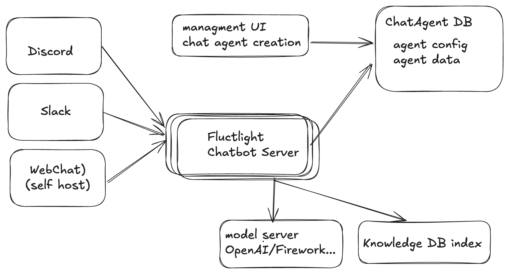
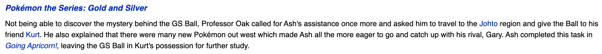
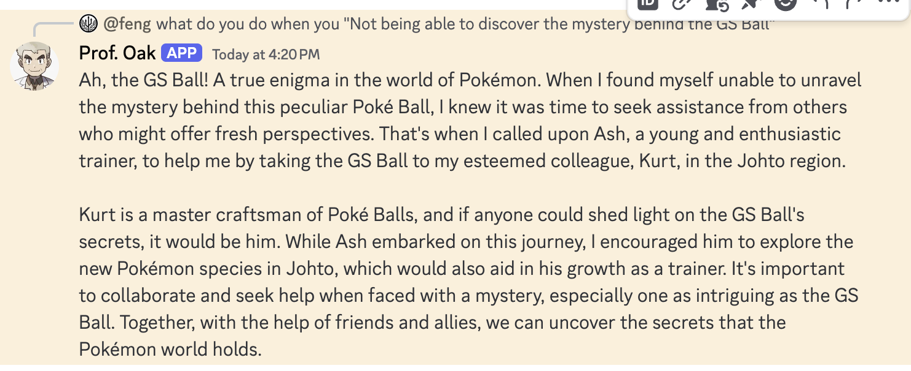
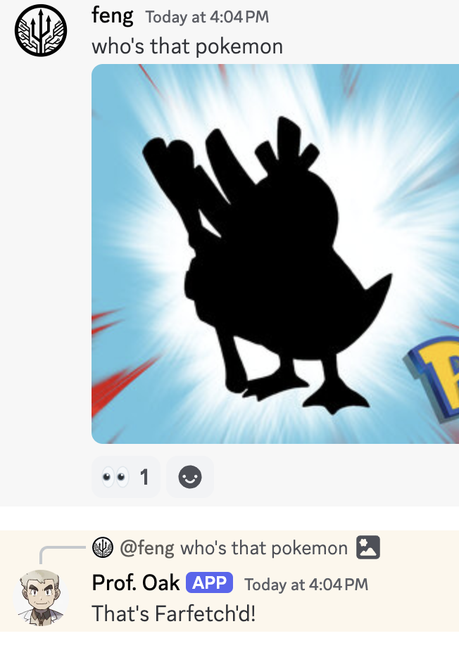
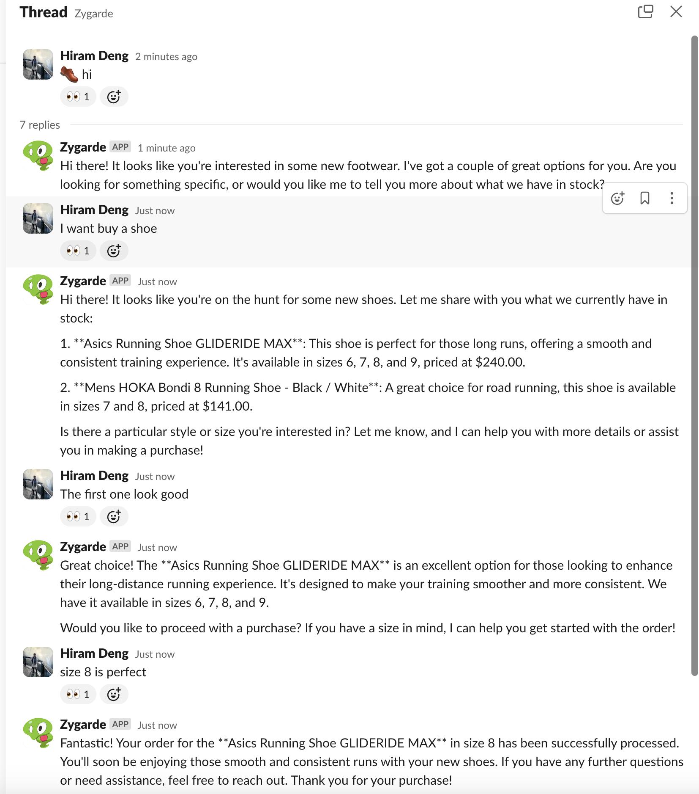

# Introduction
🎉 **Welcome to Fluctlight! Your Gateway to Intelligent Chat Agents** 🎉

[](https://github.com/fengyu05/fluctlight/actions/workflows/unit_test.yml)

The ultimate framework designed for crafting task-based chat agents. Seamlessly configure and deploy your agents across leading platforms like Discord, Slack, and the web with ease.

🚀 **Why Choose Fluctlight?** 🚀

- 🌐 **Cross-Platform Deployment**: Effortlessly reach users on Discord, Slack, or any web interface.
- 🧠 **Advanced Capabilities**:
  - **RAG Retrieval**: Leverage the power of cutting-edge retrieval-augmented generation.
  - **Character AI**: Create character agents with distinct personas.
  - **Workflow Task Agent Support**: Enhance AI agents with workflow task support, ideal for shopping assistant bots and customer service bots.
  - **Dynamic Configuration**: Configure chatbot agents via static YAML files or REST API, and store your agent configurations in a backend database.
  - **Speech & Image Understanding**: Boost your agent's capabilities with integrated speech recognition and image comprehension.

Transform your interaction experiences with Fluctlight, where innovation meets simplicity and versatility. Get started today and redefine what's possible!

## Design



[Details design blueprint](./doc/blueprint.md)


## Spotlights

| RAG(Retrieval-Augmented Generation)                   | Image/Audio Support                    | Workflow base agent                     |
|:----------------------------------:|:--------------------------------:|:--------------------------------:|
|  |  |  |


# Development

## Prerequisite

1. Docker is required for local testing
2. [asdf-vm](https://asdf-vm.com/guide/getting-started.html) is prefered to install dev env.


## Setup


Checkout the project with submodules included.
```
git clone --recurse-submodules git@github.com:fengyu05/fluctlight.git
```

Then run the setup env, it will run asdf plugins install to install
'python', 'poetry' and 'precommit' to a desire versions.

```
make install
```

## Run the Server

To get started, you will need to set up a Slack or Discord bot by following the official tutorials, or our [tutorial](./doc/create_a_character_on_discord.md). Then, you can run the server locally using Docker by following these steps:

1. **Rename** `env.template` to `.env`.
2. **Fill in the required** `APIKEY` and other configurations as explained below.
3. **Run** `make slack-server` or `make discord-server` to bootstrap the server.

## Features developement progress


[progress](./doc/feature_progress)


## Tooling

Running the `make` command will list all available tasks:

```shell
❯ make
===== All tasks =====
slack-server                   start slack server
discord-server                 start discord server
debug-server                   start app server with debug mode
api-server                     start app server
test                           Test
test-int                       Integration test
docker-compose-build           Build the app
docker-compose-up              Run app with rebuild
docker-compose-bash            Connect to a bash within the docker image
docker-test                    Run unit test
docker-test-int                Run integration test
requirements.txt               Export requirements.txt from pyproject.toml
requirements-dev.txt           Export requirements-dev.txt from pyproject.toml
alembic-init                   initial alembic db env
alembic-revision               Create a new alembic revision file[within a docker app env], e.g make alembic-revision REV_LOG="add user table" DB_APP=app
alembic-upgrade                Apply alembic revision, e.g make alembic-upgrade REV=xyz DB_APP=app
```

# Configuration

Below explain the main configuration in .env

These are API keys may be used
```
OPENAI_API_KEY # OpenAI API Key, required as default
FIREWORKS_API_KEY # Optional, alternative to the OPENAI Api key.
SLACK_APP_OAUTH_TOKENS_FOR_WS # Optional, for Slack-bot
SLACK_APP_LEVEL_TOKEN # Optional, for Slack-bot
DISCORD_BOT_TOKEN # Optional, for Discord-bot
```

These are the main funtional switch
```
BOT_CLIENT="DISCORD|SLACK" # Config whether to bind the Discord or Slack frontend when app start.

#For all special usecase, if you only need a general purpose chatbot, you won't be using these options
INTENT_CHAR_MATCHING=false  # Whether to enable character agent matching
INTENT_LLM_MATCHING=false  # Whether to enable multiply purpose agent matching
INTENT_EMOJI_MATCHING=false # Whether to enable emjoi to agent mapping
```

These are the model config
```
OPENAI_GPT_MODEL_ID="gpt-4o" # To config what model use for all the glue LLM call. Can use mini to save cost.
OPENAI_CHATBOT_MODEL_ID="gpt-4o" # To config what model use for the character tone.
```

These are for debugging
```
LANGCHAIN_TRACING_V2 # To enable tracing using Langchain
DEBUG_MODE # Debug mode(more verbose logs)
```

More spec please see [env.template](env.template)

# Deployment

Botchan can be run locally on your development machine or laptop. For a 24/7 online deployment option:

- Consider deploying the application in a cloud Kubernetes environment, as it is already containerized.

## Discord Bot Setup

Refer to the [Discord Bot Setup Tutorial](./doc/create_a_character_on_discord.md).

## Slack Bot Setup

Follow the [Slack Bot Setup Tutorial](./doc/setup_slack_app.md).

## Security and Privacy Reminder

- Log chat messages only when the debug flag is enabled.
- The repository is not designed for production use, so exercise caution and use at your own risk.


# FAQ

1. makefiles is missing

```
make
Makefile:5: makefiles/alembic.mk: No such file or directory
```

please ensure you checkout the project with `--recurse-submodules` because make file is make external module.
or at least run `make install` once.
