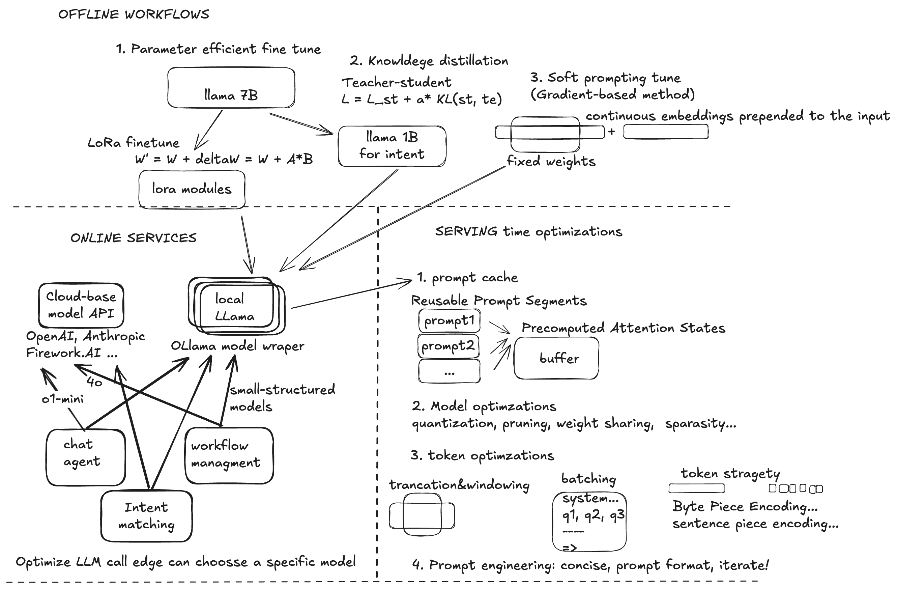
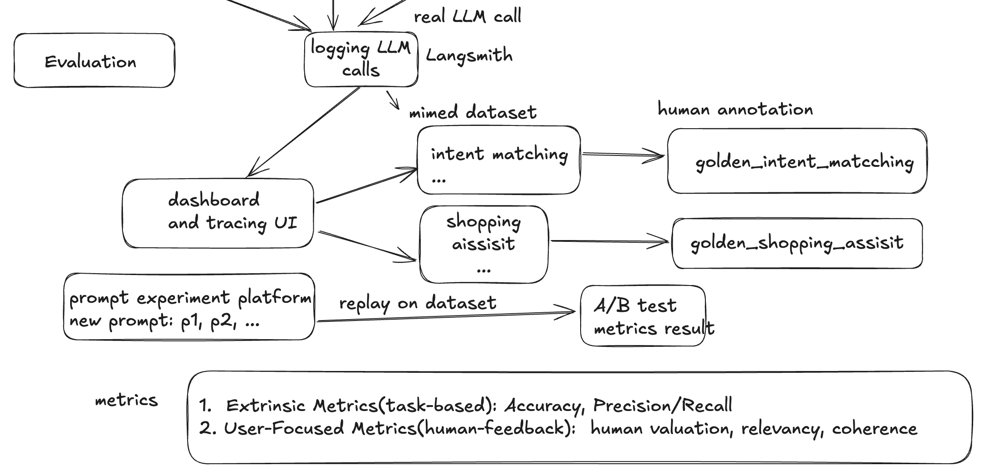

# Design Blueprint

---

## System Architecture 

### Overview
- **Purpose**: Describe the high-level components of the system.
- **Components**: Include servers, databases, APIs, and user interfaces.

### Key Features
1. Scalable Architecture
2. Microservices-based Deployment
3. Cloud Integration

---

## LLM Serving and Offline Optimization

### Online Optimization Techniques
1. prompt cache
2. model optimization
3. token optimization
4. prompt engineering

### Offline Optimization Techniques
1. PEFT
2. Knowledge Distillation
3. Soft prompt tuning

---

## Monitoring and Evaluation

### Performance Metrics
- **Accuracy**: Measure the scenarios correctness.
- **Latency**: Time taken to process requests.
- **Throughput**: Number of requests handled per second.

### Monitoring Tools
- **Langsmith**: 

### Evaluation Strategies
1. A/B Testing
2. User Feedback Analysis

---