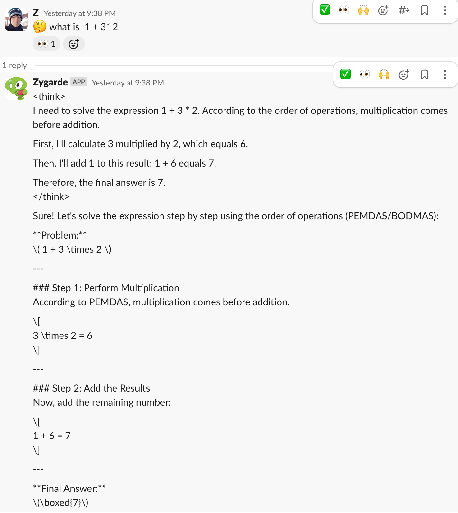

# How to Use a Self-Hosted LLM Server and Deploy Deepseek R1 as a Reasoning Model

This tutorial demonstrates how to integrate the Fluctlight Slack Bot with a locally hosted Deepseek R1 model. We’ll begin by deploying Deepseek R1 on your local environment.

## Step 1: Deploy Deepseek R1 Locally

### Option A: Run Deepseek R1 With Ollama (Docker) 

An effective way to deploy your own LLM server on a consumer-grade GPU is to use [Ollama](https://github.com/jmorganca/ollama). Thanks to its built-in quantization techniques, Ollama can efficiently run on retail GPUs like the Nvidia RTX 4090. In the author’s experience, Ollama handled the Deepseek-R1-distill-qwen-32B model seamlessly, and can scale up to manage models as large as 70B.

Below is a minimal docker-compose.yml configuration. After creating the file, run:

```bash
docker compose up
```

```docker-compose.yml
services:
  ollama-r1:
    image: ollama/ollama:latest
    runtime: nvidia
    deploy:
      resources:
        reservations:
          devices:
            - capabilities: [gpu]
    volumes:
      - ~/.ollama/models:/root/.ollama/models # mount to models folder
    environment:
      - OLLAMA_MODELS=/root/.ollama/models
      - OLLAMA_KEEP_ALIVE=5m # unload model to free up GPU after 5 min
    ports:
      - "11434:11434"
    ipc: host
```

Once this service is running, your local LLM server will be accessible on port 11434. At that point, you can configure the Fluctlight Slack Bot (or any other client) to use Deepseek R1 by pointing it to http://localhost:11434.

Ollama is particularly well-suited to personal or local projects—such as prototyping, education, or creative writing—due to several key advantages:

**User-Friendly & Easy Deployment**
	•	Simple setup (e.g., a one-line curl installation on Linux, or a GUI on macOS) and a straightforward CLI/API.
	•	Cross-platform support (Windows, macOS, Linux) and optimized performance on Apple Silicon (M1/M2).
	•	Automatic model management with a library of over 1,700 pre-configured models.

**Low Resource Consumption**
	•	Minimal memory and GPU usage, making it ideal for personal devices (e.g., laptops, tablets).
	•	Lightweight model customization (e.g., via Modelfile) and offline operation.

**Privacy & Local Execution**
	•	No reliance on cloud services; your data stays on your own machine, making it suitable for sensitive or confidential applications.

If needed, you can deploy a similar setup on a single-node Kubernetes cluster, though this tutorial does not explore that configuration in detail.


### Option B. Deploy on Kube with Vllm.

[VLLM](https://github.com/vllm-project/vllm) is an enterprise-grade solution designed for high performance, scalability, and low latency in high-traffic LLM services. It comes with built-in features such as efficient context caching (prompt cache), disaggregated inference, multi-GPU/multi-node support, and quantization for optimized deployment. It has the following advantages.

**High Performance & Scalability**
	•	Optimized throughput: Achieves up to 24x faster performance compared to Hugging Face Transformers through techniques like PagedAttention and Continuous Batching (7912).
	•	Massive concurrency: Manages 32+ simultaneous requests using dynamic batching and multi-GPU support.

**Efficient Resource Utilization**
	•	Reduced GPU memory waste: Utilizes <4% overhead, significantly lowering memory usage.
	•	Quantization support: Works with GPTQ, AWQ, and other quantization methods to reduce model footprint.
	•	Distributed inference: Supports both tensor parallelism and pipeline parallelism for enterprise-scale deployments.

**Production-Ready Features**
	•	OpenAI-compatible APIs: Seamlessly integrates with existing OpenAI-style infrastructure.
	•	Docker & Kubernetes: Straightforward to deploy with a Helm template example.
	•	Structured outputs: Allows JSON-style outputs and prefix caching for repeated queries.

***Considerations**
	•	ML Ops knowledge: Requires familiarity with managing GPU-based Kubernetes clusters and related ML Ops tooling.
	•	Memory footprint: May be larger than the default Ollama configuration, especially when scaling to larger model sizes.

An example [Helm chart](https://github.com/vllm-project/vllm/blob/main/examples/online_serving/chart-helm/values.yaml) can be found in the official GitHub repository. The author has successfully tested VLLM on a home-lab Kubernetes cluster with two GPU nodes, smoothly running a 32B distilled model under default settings.

(Stay tuned for a future guide on setting up a hybrid cloud home-lab Kubernetes cluster.)

## Step 2: Configure Fluctlight Slack Bot to Connect with a Local LLM API

Fluctlight is designed to support alternative OpenAI-compatible APIs. To achieve this, we can configure environment variables to route requests to any desired provider. Below is an example of how to set it up.

### 1. Specify the Alternate Providers

In your .env file, define the OPENAI_ALTERNATES variable to list the alternate API providers. Here, we’re adding two:
``` .env
# Comma-separated list of alternate provider names
OPENAI_ALTERNATES="DEEPSEEK,LOCAL"
```

### 2. Set Environment Variables for Each Provider
For each alternative provider, you’ll need two variables: one for the API key, and one for the API base URL.
```.env
LOCAL_API_KEY="masked"
LOCAL_BASE_URL="https://<your-llm-api-address>"
```

	•	LOCAL_API_KEY: Can be any string if you’re not enforcing a Bearer Token or other authentication mechanism.
	•	LOCAL_BASE_URL: Points to your local LLM API endpoint.

	Security Tip: If you’re exposing your API publicly, consider adding Bearer Token authorization or other authentication solutions, like HashiCorp Consul.

## 3. Define the Model IDs

Fluctlight uses two different model IDs:
	•	One for chat mode
	•	One for reason mode

You can mix and match your providers as shown below:

```.env
## Use for chat mode
GPT_CHAT_MODEL="openai:gpt-4o"

## Use for reason mode
GPT_REASON_MODEL="LOCAL:deepseek-r1:32b"
```

### 4. Usage
Once configured:
	1.	The Slack and Discord bots in Fluctlight are bound to a “reason agent” by default.
	2.	To invoke the reason mode explicitly, you can use an emoji intent, such as starting your message with :think: or :thinking_face:.
	3.	For more sophisticated scenarios, you can enable [LLM intent matching](https://github.com/fengyu05/fluctlight/blob/master/env.template#L65) so the bot will automatically decide which mode to use based on your request.



### 5. Deploying Your Bot

If you need help deploying your bot to Discord or Slack, follow these tutorials:

[Discord Deployment Guide](./doc/create_a_character_on_discord.md)
[Slack Deployment Guide](./setup_slack_app.md)


