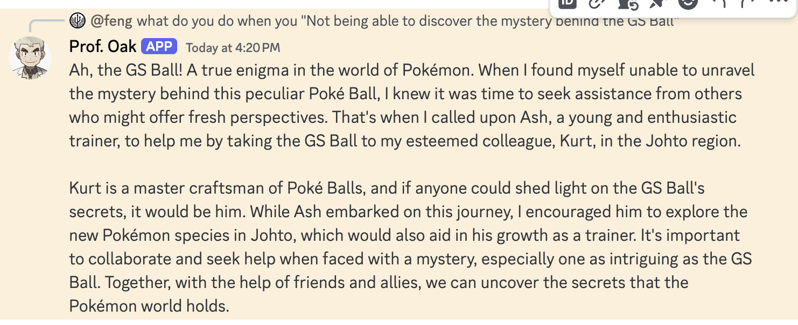

# Step 1: Create a Discord Bot and Obtain a Token

Follow these steps to create a Discord bot and get your `DISCORD_BOT_TOKEN`:

## 1. Create a Discord Application

1. Go to the [Discord Developer Portal](https://discord.com/developers/applications).
2. Click on **"New Application"**.
3. Enter a name for your application and click **"Create"**.

## 2. Create a Bot User

1. In your application, navigate to the **"Bot"** tab on the left sidebar.
2. Click **"Add Bot"** and confirm by clicking **"Yes, do it!"**.

   

## 3. Get the Bot Token

- Under the **"Bot"** tab, you will see a section called **"TOKEN"**.
- Click **"Copy"** to copy your bot token. This token is used to authenticate your bot.


- Make sure you enable this two checkbox in
    ```markdown
    **Server Members Intent**
    **Message Content Intent**
    ```


## 4. Invite Your Bot to a Server

1. Go to the **"OAuth2"** tab on the left sidebar.
2. Under **"OAuth2 URL Generator"**, select the **"bot"** scope.
3. Under **"Bot Permissions"**, select the permissions your bot needs.

   ```markdown
   - Send Messages
   - Create Public Threads
   - Create Private Threads
   - Send Messages in Threads
   - Manage Messages
   - Add Reactions
   ```

4. Copy the generated URL and open it in your browser.
5. Select the server you want to add the bot to and click **"Authorize"**.

   

## 5. Store the Bot Token

Store the copied bot token in a secure place, such as an environment variable in your `.env` file. Example `.env` entry:

```plaintext
DISCORD_BOT_TOKEN=your-bot-token-here
```

# Step 2: Obtain an OpenAI API Key

Follow the instructions provided in the [OpenAI Quickstart Guide](https://platform.openai.com/docs/quickstart) to get your API key.

Example `.env` entry:

```plaintext
OPENAI_API_KEY=your-api-key-here
```

# Step 3: Prepare the Documentation for Your Character Bot

You may place it under `data/chars_catalog`. You can copy it from here and move it to root folder of fluctlight root.

```plaintext
❯ tree data/chars_catalog/prof_oak
data/chars_catalog/prof_oak
├── config.yaml
├── data
│   └── Professor Oak (anime) - Bulbapedia, the community-driven Pokémon encyclopedia.html
└── prof_oak.png
```

We also download the basic HTML of the Professor Oak anime wiki here, for adding knowledge for RAG-based conversation. More details will be explained in the advanced topic below.

<https://bulbapedia.bulbagarden.net/wiki/Professor_Oak_(anime)>


# Step 4: Configure Your App's .env File

The minimal configuration you will need is the [here](./env.discord_tutorial.yaml). Please copy it to the github root foler as `.env`.

```yaml
# OpenAI API Key
OPENAI_API_KEY="!!!mask!!!"

# BOT_CLIENT
BOT_CLIENT="DISCORD"

# Discord bot token
DISCORD_BOT_TOKEN="!!!mask!!!"

# Enable char agent and bind "prof_oak" to it
INTENT_CHAR_MATCHING=true
CHAR_AGENT_BIND="prof_oak"

# Guild Restriction
# Set to restrict the bot to all
DISCORD_BOT_ACCESS_MODE="all" # ["all", "member", or "role_xyz"]
#DISCORD_BOT_GUILD_ID=!!!mask!!!
```

If you use "member" access mode, which means only members of your server can access the bot, then you will need to provide a guild id. Here is how you may find it.
<https://cybrancee.com/learn/knowledge-base/how-to-find-a-discord-guild-id/>

# Step 5: Run Your App Locally

We will be testing with Docker Compose. Please check `docker-compose.yml`. Likely, you don't need to edit anything as long as you did the previous step exactly as in the tutorial. If not, please update it accordingly; it's mostly some file location about where you want to put things.

```bash
make discord-server
```

Now, you should be able to go to your Discord server.

Some basic testing:


What happens behind the scenes is that the character agent will load the `config.yaml` you put under the `prof_oak` folder and initialize the character to be Prof. Oak instead of the general GPT 'helpful assistant'. Any customization in the system and user prompt can be configured in the `config.yaml`.


Of course, Prof. Oak can also see. You may upload a picture to test his Pokémon knowledge.

# Advanced Topic: Enable RAG-based Knowledge Loading and Retrieval

To do this, you need to flip the flag `OVERWRITE_CHROMA=false` to true, then run `make discord-server`.

If it's successful, you should see a lot of the Langchain text splitting trying to load the huge HTML file and chunk it into pieces of knowledge indexing. In our case, we have 1 character load (which is Professor Oak) along with 831 documents after chunking.

```plaintext
...
server-discord-1  | WARNING:langchain_text_splitters.base:Created a chunk of size 1018, which is longer than the specified 500
server-discord-1  | WARNING:langchain_text_splitters.base:Created a chunk of size 1084, which is longer than the specified 500
...
server-discord-1  |   self.embedding_db.persist()
server-discord-1  | INFO:fluctlight.agent_catalog.catalog_manager:{"event": "Total document load: 831", "timestamp": "2025-01-04T00:17:23.657195Z", "level": "info", "logger": "fluctlight.agent_catalog.catalog_manager"}
```

Now you can stop the server, flip the flag back to false, and run `make discord-server`. You should be able to see the server still load 831 documents from its data (which are persisted chroma by default).

```plaintext
server-discord-1  | INFO:fluctlight.agent_catalog.catalog_manager:{"event": "Total document load: 831", "timestamp": "2025-01-04T00:18:59.911249Z", "level": "info", "logger": "fluctlight.agent_catalog.catalog_manager"}
```

Now, let's test Professor Oak with very specific knowledge that happens in these documents. We will ask the story about the GS ball in the Gold and Silver series, which the answer is here (snapshot from the wiki page).


Now, we notice the log found 4 documents:

```plaintext
server-discord-1  | INFO:fluctlight.agents.character.openai_character_agent:{"event": "Found 4 documents", "timestamp": "2025-01-04T00:20:21.275025Z", "level": "info", "logger": "fluctlight.agents.character.openai_character_agent"}
```



And Prof. Oak correctly recalls this specified piece of information!

# Step 6: Deploy to the Cloud

To ensure your character is always online and accessible, consider deploying it on a cloud backend. This way, you won't need to keep your laptop terminal running continuously. There are several powerful options available, all of which follow standard container-based application practices.

If you have access to a Kubernetes cluster—whether on AWS EKS or GCP GKE—you can easily deploy using the provided YAML template. Embrace the learning journey as you make adjustments and refine your setup.

Here's to seamless deployments and bringing your character to life in the cloud! 🚀✨

For your convenience, you can find the deployment YAML template [here](./discord_server_depoyment.yaml).
